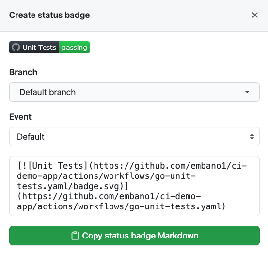
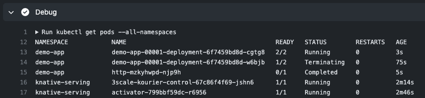

# Github Actions in Action 🎬

Let's take a tour through the individual workflows defined in this repository...

💡 **Note:** Use the table of content created by Github to easily navigate
through this document.

## Workflow Overview ⏯

These are the Github Actions [workflows](./.github/workflows/) currently defined
and used in this repository:

| Category              | Definition                                           | Triggered on                                              | Description                                             |
| --------------------- | ---------------------------------------------------- | --------------------------------------------------------- | ------------------------------------------------------- |
| Issues                | [Issue Greeting](#issue-greeting-)                   | `[issues].[opened]`                                       | Send (templatized) greeting when a new issue is created |
| Issues, Pull Requests | [Close Stale](./.github/workflows/stale.yaml)        | `[schedule].["daily"]`                                    | Flag and close stale issues/PRs                         |
| Pull Requests         | [Check WIP](./.github/workflows/check-wip.yaml)      | `[pull_requests].[opened, synchronize, reopened, edited]` | Fail check when title contains "WIP" (work in progress) |
| Pull Requests         | [Unit Tests](./.github/workflows/go-unit-tests.yaml) | `[pull_request].["main", "master", "release-*"]`(*)       | Run Go unit tests                                       |
| Pull Requests         | [E2E Tests](./.github/workflows/go-e2e-tests.yaml)   | `[pull_request].["main", "master", "release-*"]`(*)       | Run E2E tests                                           |
| Pull Requests         | [Build](./.github/workflows/build.yaml)              | `[pull_request].["main", "master", "release-*"]`(*)       | Verify build and artifacts ("releasability")            |
| Release               | [Create Release](./.github/workflows/release.yaml)   | `[push].[tags="v*"]`                                      | Create Github release                                   |
| Code Scan             | [CodeQL Analysis](./.github/workflows/release.yaml)  | `[schedule].["daily"],[pull_request].["main"]`(*)         | Scan for security vulnerabilities                       |

\* Also runs on `[push].["main", "master"]`

The subsequent sections in this document describe these workflows in detail.

### Creating Badges from Workflows

The nice thing about workflows in Github is that their results can be used to create badges, i.e. status indicators, at the front page (e.g. `README`) of your project. Here is an example from this repository:


This feature is available for all workflows and can be easily
[accessed](https://docs.github.com/en/actions/managing-workflow-runs/adding-a-workflow-status-badge)
in the workflow details. The Github UI gives you some customization options and
a ready to use markdown snippet which can be directly used.



#### Custom Badges

You might notice in the screenshot above that besides workflow status badges
this repo has a couple of more badges defined, for example:

- Latest release
- Go code quality report
- Go version used (to indicate compatibility)
- Code coverage

Check out the raw `README.md` [file](./README.MD) of this project to see how
they're generated.

[`Shields.io`](https://shields.io/) is a great service to generate custom
badges. This
[gist](https://gist.github.com/afig/be5ab20c50062dba7cb835e30206659a) provides a
good description of how to use this service. If you want some more inspiration
see this [repository](https://github.com/Naereen/badges). 

# Workflow Details 🧐

## Workflow: Issue Greeting 👋

Sends a *templatized* greeting to Github users on every new issue, but only to
user accounts who have not contributed to this repository before to reduce the
noise for existing contributors.


### Details

The workflow ([YAML](./.github/workflows/issue-greeting.yaml)) uses conditional
syntax to only greet
[non-contributors](https://docs.github.com/en/graphql/reference/enums#commentauthorassociation),
i.e. users who have not committed or created a PR (`if:
github.event.issue.author_association == 'NONE'`).

If this check passes, the `chuhlomin/render-template@v1.2` action renders a
greeting body based on a custom [template](./.github/comment-template.md). 

The output of the render action (`${{ steps.template.outputs.result }}`) is used
by the `peter-evans/create-or-update-comment@v1` action to construct the
greeting for the particular issue ID that triggered the workflow. All Github
events contain detailed information which is made available in the workflow via
[context](https://docs.github.com/en/actions/reference/context-and-expression-syntax-for-github-actions#contexts)
attributes, e.g. `${{ github.event.issue.number }}`.

💡 **Note:** When a step or action in a workflow needs read/write access to the
repository, it can use a dedicated security token available in each workflow run
[`GITHUB_TOKEN`](https://docs.github.com/en/actions/reference/authentication-in-a-workflow).
See see security section in [details](./DETAILS.md) for more information about
token permissions and scoping.

Instead of using a community action to comment on an issue, one can also use the
Github CLI `gh` which makes it easy to perform various tasks on a repo. 

To avoid being prompted for authentication credentials when using the `gh` CLI,
the following snippet can be used in a workflow step to set the `GITHUB_TOKEN`
secret as an environment variable:

```yaml
- name: Create issue with gh CLI
  env:
    GITHUB_TOKEN: ${{ secrets.GITHUB_TOKEN }}
  run: |
    gh issue create --title "Fix XYZ" --body "XYZ is broken 😧 "
```

## Workflow: Close Stale ⌛️

Periodically scans issues and pull requests in the repository for staleness on a
nightly (*cron*) schedule.


### Details

This workflow ([YAML](./.github/workflows/stale.yaml)) is rather simple and uses
the official and popular action `"actions/stale@v3"` from Github to manage the
lifecycle of issues and pull requests.

This action is highly customizable and can be configured to act on issues
**and/or** pull requests. In this repo, issues and PRs are marked as stale after
90 days (the label `"lifecycle/stale"` will be created and attached) and closed
after another 30 days of inactivity. If a there are new comments on the
issue/PR, the action will unmark the object accordingly. If a specific label
(here `"lifecycle/frozen"`) is set, the action skips the object.

There's not much more to say about the action, as its well
[documented](https://github.com/actions/stale) and thus self-explanatory. 

💡 **Note:** If you enable this action in a repository with many open issues or
PRs, it might take some time for the action to go through them as a rate limit
is applied to prevent Github API throttling.

## Workflow: Check "WIP" 🚧

Scan pull request titles if they are marked as work in progress ("WIP") and fail
the status check accordingly to indicate this to reviewers.


### Details

This workflow ([YAML](./.github/workflows/check-wip.yaml)) is also pretty simple
but was created to show how to build a custom action using just `Bash` commands
and pattern matching. More flexible, community provided "WIP" checkers can be
found the [marketplace](https://github.com/marketplace?type=actions&query=wip).

To allow users to change the title and have the action react accordingly, the
workflow is triggered on the following pull request event types: `[opened,
synchronize, reopened, edited]`.

## Workflow: Unit Tests 📄

Run Go unit tests on pull requests and every commit (`push`) to the main branch
to verify code changes and contributions are not leading to regressions.

### Details

In this workflow ([YAML](./.github/workflows/go-unit-tests.yaml)) the concept
(and power) of [matrix
tests](https://docs.github.com/en/actions/reference/workflow-syntax-for-github-actions#jobsjob_idstrategymatrix)
in Github Actions is introduced. If you've used other CI tools, this concept
will be familiar.

As part of a job, a matrix (think table here) of key/value combinations can be
used to reduce repetitive YAML job definitions and keep the workflow flexible
and extensible, e.g. easily add a new test for a specific Go version.

Even though this workflow only uses a single key in the `go-version` value
array, it's a good practice to write your workflow with a matrix definition
right away so it can be easily extended later.

```yaml
matrix:
  go-version: ["1.16"]
  platform: ["ubuntu-latest", "windows-latest"]
```

To enforce a certain level of test coverage, various code coverage analysis
platforms can be integrated in a workflow. This workflow automatically sets up
code coverage reporting using the [Codecov](https://codecov.io/) service and its
configuration [file](-/../.codecov.yaml).

Detailed coverage information are shown in pull requests and the corresponding
PR check will be marked as failed if it does not meat the desired code coverage
ratio.


The `andstor/file-existence-action@v1` action is used to decide whether `go
test` should be run with coverage enabled, i.e. produce a (local) code coverage
report.

If the file is found, `COVER_OPTS` are set and stored as an environment variable
using the Github Actions redirect pattern `>> $GITHUB_ENV`. Otherwise
`COVER_OPTS` will be empty (`""`) and ignored by `go test`.

```yaml
- name: Check for .codecov.yaml
  id: codecov-enabled
  uses: andstor/file-existence-action@v1
  with:
    files: .codecov.yaml

- if: steps.codecov-enabled.outputs.files_exists == 'true'
  name: Enable Go Coverage
  run: echo 'COVER_OPTS=-coverprofile=coverage.txt -covermode=atomic' >> $GITHUB_ENV

- name: Test
  env:
    GOFLAGS: "-mod=vendor -v -race"
  run: go test $COVER_OPTS ./...
```

By using a conditional expression `steps.codecov-enabled.outputs.files_exists ==
'true'`, the report will be uploaded to Codecov if the earlier specified file
was found. Otherwise this step will be skipped.

```yaml
- if: steps.codecov-enabled.outputs.files_exists == 'true'
  name: Produce Codecov Report
  uses: codecov/codecov-action@v1
```

💡 **Note:** Please read the documentation of Codecov (or your preferred
coverage analyzer platform) for how to enable and configure such a service in
your repository and use with Github Actions.

#### More information about the Matrix 

Since matrix definitions are referred to via variable names in individual fields
of a job step, matrix definitions can also serve as templates in job/step
definitions, reducing the chances of copy and paste errors. These variables can
be used anywhere in your steps, e.g. inside `name:`, in custom actions `with:`
clauses, in `timeout-minutes:`, `env:` and of course in the `run:` block.

The following snippet will create four jobs printing the corresponding Go
version when triggered:

```yaml
strategy:
  matrix:
    go-version: ["1.15","1.16"]
    platform: ["ubuntu-latest", "windows-latest"]
runs-on: ${{ matrix.platform }}
timeout-minutes: 10
steps:
- name: Set up Go ${{ matrix.go-version }}
  uses: actions/setup-go@v2
  with:
    go-version: ${{ matrix.go-version }}
  id: go
- name: Print Go version
  run: |
    go version
```

Advanced options to configure parallelism and failure handling are available in
matrix tests. For a more complex example with individual overwrites for failure
handling, see this workflow in the
[`govmomi`](https://github.com/vmware/govmomi/blob/master/.github/workflows/govmomi-govc-tests.yaml)
code base.

## Workflow: E2E Tests 📑

Run end-to-end system tests on pull requests and every commit (`push`) to the
main branch to verify code changes and contributions are not leading to
regressions.

### Details

This workflow ([YAML](./.github/workflows/go-e2e-tests.yaml)) shows how to
easily set up more complex integration/E2E test environments, e.g. build and deploy
the application under test in a Kubernetes environment to run end to end tests
written in Go.

The workflow uses one job which runs the steps sequentially until an error
occurs or the workflow terminates successfully. 

First, the job dependencies (here `ko` and `kind`) are fetched to fail fast in
case of a missing dependency. Then, a single node (default) Kubernetes cluster
is bootstrapped using `kind`. Of course, one can easily extend this with a
custom configuration inside the `run:` block, e.g. `cat <<EOF > kind.cfg`
(details omitted).

To make the setup a bit more exciting, the application will be built from
scratch with `ko` and then deployed as a Knative
[Service](https://knative.dev/docs/serving/). 

Thus, Knative needs to be installed before deploying the app and running the
tests. There are a couple of steps involved and to ease readability of a job
output, output
[grouping](https://docs.github.com/en/actions/reference/workflow-commands-for-github-actions#grouping-log-lines)
commands are used to separate the individual sections. 

```yaml
echo "::group::Serving CRDs"
kubectl apply -f https://github.com/knative/serving/releases/download/${KNATIVE_VERSION}/serving-crds.yaml
kubectl wait --timeout=20s --for=condition=Established crd/services.serving.knative.dev
echo "::endgroup::"
```

This results in the following output during a run:


The end-to-end tests depend on a Go client
[application](./test/test_images/http/main.go) which makes HTTP calls to the Go
server. With `ko`, this client application can be easily packaged as a container
and loaded into the `kind` cluster. This is done via the
[`upload_test_images.sh`](./test/upload_test_images.sh) script. `ko` knows where
to push (inject) the container image with the help of global environment
variables defined in the workflow:

```yaml
env:
  KO_DOCKER_REPO: kind.local
  KIND_CLUSTER_NAME: e2e
```

Note that at this point the client application is not running yet. It will be
created as part of the Go E2E tests in the next steps.

Now that the requirements are all set up, the Knative server application can be
created. Again, `ko` is used to build a fresh container image based on the code
checked out during this run, e.g. from a pull request.

`ko resolve` will then build the Go application based on the YAML definition
provided (`ko://` prefix).

In most of the steps [`kubectl
--wait`](https://kubernetes.io/docs/reference/generated/kubectl/kubectl-commands#wait)
is used which avoids races and issues with latencies to ensure that the
requirements, e.g. Knative, are met before proceeding. `--wait` is customizable
and will return an error if the `condition` in the object's status is not met
within a defined `timeout`.

Now it's time to run the end-to-end tests. This repository does not use a fancy
test suite (which you probably would/should), to keep the code and complexity of
the concepts shown as simple as possible.

A couple of helper and setup steps are used to retrieve a Kubernetes client for
programmatic API access and create a Kubernetes `Job` which will use the
container image of the HTTP client app built earlier to call the application
server. `Jobs` are neat as they help signaling completion (or errors) which can be used in a test to pass/fail:

```go
waiter := func() {
	// Wait for the Job to report a successful execution.
	waitErr := wait.PollImmediate(pollInterval, pollTimeout, func() (bool, error) {
		j, err := client.BatchV1().Jobs(env.Namespace).Get(ctx, name, metav1.GetOptions{})
		if err != nil {
			if errors.IsNotFound(err) {
				t.Logf("job not found: %v", err)
				return false, nil
			}
			return true, err
		}
		t.Logf("Active=%d, Failed=%d, Succeeded=%d", j.Status.Active, j.Status.Failed, j.Status.Succeeded)
		// Check for successful completions.
		return j.Status.Succeeded > 0, nil
	})
	if waitErr != nil {
		t.Fatalf("waiting for Job to complete successfully: %v", waitErr)
	}
}
```

As a last step, and marked to always run independent from any previous step
error (`if: ${{ always() }}`) all pods, and details on specific events and pods
are printed to the workflow output console which can be helpful during troubleshooting.



💡 **Note:** See the [details](./DETAILS.md) page to read more about the
individual tools used here.

## Workflow: Release 📑

Create a new Github
[Release](https://docs.github.com/en/github/administering-a-repository/releasing-projects-on-github/managing-releases-in-a-repository)
when a [semver](https://semver.org/) tag (starts with `"v"`) is pushed.

### Details

This workflow ([YAML](./.github/workflows/release.yaml)) does the heavy lifting of creating a Github Release. A code owner only has to create and push a git tag starting with `"v"` which triggers the workflow using a filter expression:

```yaml
on:
  push:
    tags:
      - "v*"
```

💡 **Note:** For simplicity tags are not verified to be semver-compliant and
assumed to start with `"v"`, e.g. `v0.2.9`. This is more of a convention rather
than a strict semver requirement used in this project.

As part of a new release the following artifacts are created:

- Binaries for the common `GOOS/GOARCH` combinations (incl. `arm64` 🍎 &nbsp; Mx-Series)
- Source tarballs
- Multi-arch 🐳 &nbsp; Docker images (incl. `arm64` for the 🍎 &nbsp; Mx-Series)
- Homebrew 🍺 &nbsp; `tap` (formula)
- Release Notes
- `CHANGELOG.md`

See [How to create a release](#how-to-create-a-release) to understand how this
workflow is triggered and see it in action. 

#### Workflow Jobs

This workflow is slightly more complex than the previous ones so here's a
summarized breakdown of the individual jobs and steps involved to create a
release.

The pipeline consists of three jobs, whereas two of them have a dependency on
the first one, i.e. they will only be executed if the dependent job is
successful (see `needs: release`).

1) "Create Release" (`id: release`)
1) "Create CHANGELOG PR" (`id: pull-request`)
1) "Release ko Artifact and Docker Image" (`id: images`)

##### Job `id: release`

With `actions/checkout@v2` the repository is checked out as usual, but with two additional parameters:

```yaml
uses: actions/checkout@v2
with:
  fetch-depth: 0
  ref: "main"
```

`fetch-depth: 0` (set to `1` by default) will fetch the whole git commit history
(instead of the last commit) which is required to generate a proper `CHANGELOG`.
The branch checked out is set to `"main"` to ensure we're operating on the
`main` branch when performing these steps. Strictly speaking, this is not really
required for this job but it's a good practice to document the expected
behavior, i.e. tags are expected to be made against `main` here.

Next, a `RELEASE_CHANGELOG.md` is generated with `git-chglog` (which is a
vendored dependency in this project). This `CHANGELOG` only contains the commits
for the current tag (passed as dynamic parameter `$(basename "${{
github.ref}}")` to the program) and will be used as a file input to `goreleaser`
in the last step of this job.

By using the `goreleaser/goreleaser-action@v2`, the setup is simplified and a
release is created as defined by the `goreleaser` configuration
[file](.goreleaser.yaml) in this project.

`goreleaser` will build the artifacts and then create a new release on Github. By
default, it uses the token set via the `GITHUB_TOKEN` environment variable which
is expected to have repo-level write permissions.

We use the Github Actions CI token here for convenience.

```yaml
env:
  GITHUB_TOKEN: ${{ secrets.GITHUB_TOKEN }}
  GORELEASER_TOKEN: ${{ secrets.GORELEASER_TOKEN }} # see following note further below
```

The `goreleaser` configuration is also set up to push a Homebrew formula 🍺 on every release.

```yaml
brews:
  - name: demo-app
    ids:
      - demo-app
    tap:
      owner: embano1
      name: homebrew-ci-demo-app
      # needs repo permissions on target, eg using PAT
      token: "{{ .Env.GORELEASER_TOKEN }}"
```

But we cannot reuse the `GITHUB_TOKEN` above for this activity because it does
not have write permissions on the repository where the Homebrew formula is
stored (pushed to), that is `homebrew-ci-demo-app`.

A dedicated Github Personal Access token
([PAT](https://docs.github.com/en/github/authenticating-to-github/keeping-your-account-and-data-secure/creating-a-personal-access-token))
with write permissions is used to grant `goreleaser` the required permissions. The
mapping to tie everything together is done with an environment variable
`GORELEASER_TOKEN` in the corresponding files.

##### Job `id: pull_request`

The (updated) `CHANGELOG` for a new Github Release and the repository can only
be created after a tag has been created. We have a typical 🐓 and 🥚 dilemma
here.

The approach used in this repository is to create a commit and pull request
after a new release to update the `CHANGELOG.md` file accordingly. This is done
via the `peter-evans/create-pull-request@v3` action.

The action will create a pull request based on the commit with the
`CHANGELOG.md` updated for all tags (instead of a specific commit as in the
previous job).

To reduce noise, commits created by this bot (action) are configured to be
filtered out in the CHANGELOG, see the [template](./.chglog/CHANGELOG.tpl.md)
for details.


##### Job `id: images`

Because `goreleaser` was intentionally configured to skip building Docker images
(see [DETAILS](DETAILS.md) for an explanation), a final step after a successful
release is to create container images and a Kubernetes manifest that can be
directly used by end-users.

Remember that the Kubernetes (Knative) application
[manifest](./config/service.yaml) in this repository uses the `ko://` prefix,
which cannot be used as input to Kubernetes, e.g. `kubectl`.

As already mentioned, jobs do not share state by default so after pulling the
`ko` dependency another checkout is required.

💡 **Note:** As a best practice, steps to download/set up dependencies for your
job should be performed early in the job steps to fail fast in case of error and
reduce resource usage (costs). Using (global) environment variables for
dependency version helps to keep the code/scripts generic.

Before creating the (multi-platform/arch) container images, two helper steps are
run to get the Github release URL and shortened git commit SHA (8 characters)
which are used in subsequent steps.

Then `ko resolve` is run to create the container images for all platforms
(`--platform=all`) with three tags, e.g. `<image>:ABCD5678` (SHA8),
`<image>:v0.2.8` (tag) and `<image>:latest`.

`ko` knows how to construct the image name and where to push to since we set a
job environment variable in the workflow:

```yaml
env:
  KO_DOCKER_REPO: docker.io/embano1
```

Authentication to Docker Hub is done via repository secrets to in a call to
`docker login` at the beginning of the job.    

```yaml
steps:
  - name: Docker Login
    run: docker login -u ${{ secrets.DOCKERHUB_USERNAME }} -p ${{ secrets.DOCKERHUB_PASSWORD }}
```

After the images were pushed (done by `ko resolve`) `ko` outputs the Kubernetes
manifest(s) with image details to standard out, which is redirected to a file
(`release.yaml`) for further processing.

```yaml
apiVersion: serving.knative.dev/v1
kind: Service
metadata:
  name: demo-app
spec:
  template:
    spec:
      containers:
        # ko injected image using secure SHA256 syntax
        - image: docker.io/embano1/ci-demo-app@sha256:9f5794ef2828e43a999b2b36aa7878ae795a13755a1eca31381d395887742cb6
          readinessProbe:
            httpGet:
              path: /healthz
```

The updated Kubernetes manifest is added to the release as another artifact with
`actions/upload-release-asset@v1` as a helper. The release upload URL is
extracted from a the previous step (`get_release_url`) which create an output
variable that can be referenced via `${{
steps.get_release_url.outputs.upload_url }}`.

```yaml
- name: Upload Release Assets
  id: upload-release-asset
  uses: actions/upload-release-asset@v1
  env:
    GITHUB_TOKEN: ${{ secrets.GITHUB_TOKEN }}
  with:
    upload_url: ${{ steps.get_release_url.outputs.upload_url }}
    asset_path: ./src/github.com/${{ github.repository }}/release.yaml
    asset_name: release.yaml
    asset_content_type: text/plain
```

This completes the detailed walkthrough to the release jobs. The following
sections describe how to create a release from the command line.

### How to create a Release

Check out the `main` branch and make sure it's in sync with `upstream/main`.

⚠️ **Note:** The remote is named `upstream` in the examples.

```console
$ git checkout main

$ git pull upstream main
From github.com:embano1/ci-demo-app
 * branch            main       -> FETCH_HEAD
Already up to date.
```

Create a new release tag:

```console
$ RELEASE=v0.2.8
$ git tag -a $RELEASE -m "Release ${RELEASE}"
```

Push the new tag:

```console
$ git push upstream refs/tags/${RELEASE}
Enumerating objects: 1, done.
Counting objects: 100% (1/1), done.
Writing objects: 100% (1/1), 165 bytes | 165.00 KiB/s, done.
Total 1 (delta 0), reused 0 (delta 0), pack-reused 0
To github.com:embano1/ci-demo-app.git
 * [new tag]         v0.2.8 -> v0.2.8
```

Observe the status of the corresponding release workflow triggered by this new
tag in the Actions [dashboard](https://github.com/embano1/ci-demo-app/actions).


### Result

In the details of each run one can inspect the workflow stages.


As part of the release workflow (Action), detailed release notes will be
automatically pushed to the release page:


In addition, a pull request is automatically opened to update the `CHANGELOG.md`
file of the repo by appending the changes from the specific release tag. 

This step could be completely automated, but was intentionally made
semi-automated to show how a pull request can be created as part of a
[workflow](.github/workflows/release.yaml) using the `gh` CLI.


## Workflow: CodeQL Analysis 🕵️‍♀️

Run Github's CodeQL security engine on the code base.

### Details

This workflow ([YAML](./.github/workflows/codeql-analysis.yml)) was generated by
Github as part of their continuous effort to increase code quality and security.
A detailed step-by-step guide can be found
[here](https://docs.github.com/en/code-security/secure-coding/automatically-scanning-your-code-for-vulnerabilities-and-errors/setting-up-code-scanning-for-a-repository).

Once the workflow is defined, CodeQL will be run on every commit, pull request
and on a pre-defined schedule to find security issues.

The results can be inspected by repository owners in the security section.


