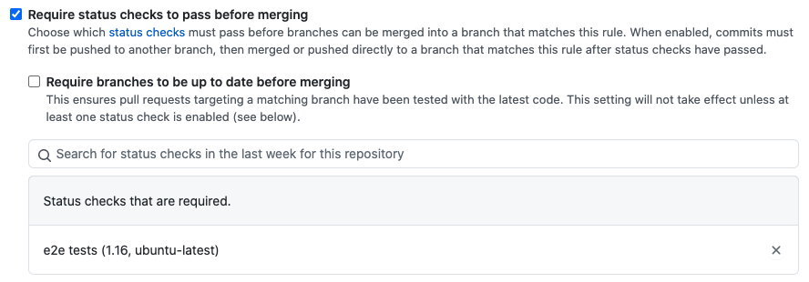

# The nitty gritty Details 🤓

This document provides details on Github Actions, the Go demo application and
related deployment tools used in this repository.

💡 **Note:** Use the table of content created by Github to easily navigate
through this document.

## Github Actions (GHA)

Github Actions is the work horse used throughout the repository to
implement continuous integration. To quote from the docs:

> GitHub Actions makes it easy to automate all your software workflows, now with
> world-class CI/CD. Build, test, and deploy your code right from GitHub. Make
> code reviews, branch management, and issue triaging work the way you want.

If you are already familiar with continuous integration, you might have a low
learning curve in adopting Github Actions. But even if you are just starting
your journey into automating the release project for your (Go) application,
Github Actions has an easy to learn syntax, using YAML files to define your
workflows.

This project focuses on automating various steps in the release process of a Go
application, but note that Github Actions can be used for any programming
language. You can even use Github Actions to automate your infrastructure by
running scripts on a schedule, etc. The possibilities are endless.

And with the growing community providing 3rd party actions in the
[marketplace](https://github.com/marketplace?type=actions), you are likely to
find a ready to use action to solve your task.

What makes GHA unique in my opinion (YMMV):

- Deep integration into Github (with a generous free tier)
- Easy to learn (YAML) syntax, which gets you started quickly but also allows
  for very
  [complex](https://docs.github.com/en/actions/learn-github-actions/managing-complex-workflows)
  workflow definitions
- Growing community ([marketplace](https://github.com/marketplace?type=actions), tutorials, etc.)
- Easy to write your [custom actions](https://docs.github.com/en/actions/creating-actions) for reuse and sharing
- [Templates](https://docs.github.com/en/actions/learn-github-actions/sharing-workflows-with-your-organization)
  and [environments](https://docs.github.com/en/actions/reference/environments)
  integration for organizations
- Fully managed [runners](https://docs.github.com/en/actions/using-github-hosted-runners) (executors) for Linux, OSX and Windows
- Option to use [self-hosted](https://docs.github.com/en/actions/hosting-your-own-runners) runners in your own infrastructure

GHA workflows are executed in dedicated (isolated) runners. The fully managed
and publicly available runners are Azure hosted virtual machines. You can read
more about the hardware specs and installed software
[here](https://docs.github.com/en/actions/using-github-hosted-runners/about-github-hosted-runners).

### When are Workflows run?

Workflows are triggered based on a variety of (configurable) events, e.g. `on`:

- Push (commit), Pull Requests, Issues, tags, releases, etc.
- Schedule ("cron")
- External events or manually

See the
[details](https://docs.github.com/en/actions/reference/events-that-trigger-workflows#configuring-workflow-events)
for a complete listing of events and triggers.

#### Skipping Workflow Runs

You can skip workflows from executing by using [pre-defined
strings](https://docs.github.com/en/actions/guides/about-continuous-integration#skipping-workflow-runs)
in your commit title/message.

⚠️ **Note:** This can be abused by malicious actors to bypass workflows in PRs.
This can be avoided by requiring status checks via branch protection
[rules](https://docs.github.com/en/github/administering-a-repository/about-protected-branches#require-status-checks-before-merging),
e.g. a particular workflow, to pass before merging a PR.



#### Troubleshooting Workflows/Runners

If the workflow logs or Github UI do not provide you with enough detail why a
workflow is not behaving as expected, there's several options to troubleshoot:

- Reproduce the workflow steps locally (e.g. in a SHELL or with
  [act](https://github.com/nektos/act))
- Add more DEBUG information to the workflow (see the E2E
  [workflow](./.github/workflows/go-e2e-tests.yaml) for an example)
- Use [tmate](https://github.com/mxschmitt/action-tmate) to exec into a runner

### Workflow Syntax

Github Actions workflows are defined via YAML files placed in the
`.github/workflows` folder at the root of your Git project. At a very high
level, this is the syntax of a fully working example workflow:

```yaml
# name of the workflow shown in the UI
name: Example workflow

# run on every commit (all branches) and pull requests
on: [push, pull_request]

# set global envs for all jobs
env:
  TARGET: "production"

# set global defaults for all jobs
defaults:
  run:
    shell: bash

# define jobs, where job 1 and 2 run in parallel
jobs:
  job1:
    name: Run job 1
    # use ubuntu runner (latest version)
    runs-on: ubuntu-latest
    # sequence of 1..n steps in a job
    steps:
      # use a pre-defined action instead of custom script
      # actions can be written in Javascript, Bash or Docker containers
      - name: Check WIP in PR Title
        uses: embano1/wip@v1

  job2:
    name: Run job 2
    # use windows runner (latest version)
    runs-on: windows-latest
    steps:
      - name: Set up Go 1.19
        uses: actions/setup-go@v2
        with:
          go-version: "1.19"
      - name: Print Go version
        # execute arbitrary commands in defined SHELL
        run: |
          go version # prints Go version

  job3:
    # only runs when job1 is successful
    name: Run job 3
    needs: [job1]
    # set custom environment variables, inheriting globals
    env:
      APP_VERSION: "3.0"
    # use ubuntu runner with a specific version
    runs-on: ubuntu-18.04
    steps:
      - name: Print environment variables
        run: |
          echo ${APP_VERSION} # prints "3.0"
          echo ${TARGET}      # prints "production"
```

If you are wondering whether a bad actor could extract sensitive information
from your repository, e.g. by creating a pull request which includes a new
workflow to print all secrets defined, read this
[post](https://github.blog/2020-08-03-github-actions-improvements-for-fork-and-pull-request-workflows/)
to understand how Github Actions protects you by default - and how this behavior
can be changed on a case by case basis.

⚠️ **Note:** As a security best practice, you should always vet actions before
using them. Also, it is recommended to use the full commit hash when referencing
an action in your workflow, e.g.
`actions/setup-go@c46424eee26de4078d34105d3de3cc4992202b1e`. This repo does not
follow this guidance though as a tradeoff between usability, maintenance
overhead and security. For more security related concerns, see the links
provided under [security](#security).

By default (for performance and security reasons) workflows and jobs do not
share information, e.g. files, caches or other temporary data. Github provides a
convenience [action](https://github.com/actions/cache) to use caching across
your workflows. Individual steps within the **same job** have access to data
created in a previous step of that particular job and run, though.

For pattern matching and filtering, e.g. to trigger a
workflow on changes inside a directory or file extension, see [Filter pattern
cheat
sheet](https://docs.github.com/en/actions/reference/workflow-syntax-for-github-actions#filter-pattern-cheat-sheet).

Many parameters are available to fine-tune the behavior of jobs and steps,
including failure handling, matrix testing strategies (to reduce clutter),
information reuse across steps, running and exposing Docker containers
(services), etc. 

For more details check out the resources provided under [learning
resources](#learning-resources).

### Testing your Workflows

Once you have created your first YAML workflow definition, you might be
wondering how to easily (and non-disruptively) test it in the wild.

As usual, there's different patterns and "best practices" here, so I asked the
Twitter community
([tweet](https://twitter.com/embano1/status/1313902565164232710)).

Here are some approaches:

- Set up a sandbox (playground) repository
- Use [act](https://github.com/nektos/act) to execute workflows locally
- Fork a repository and push your commits there before creating a PR (see note below)
- Target a self-hosted runner

Regarding the fork/PR approach: this is a good solution and works fine in most
of the cases. Your fork must have Github Actions enabled (default) and won't be
able to access secrets from the upstream repo (see security section
[below](#security)). You can then create PRs in your repo which trigger PR-based
workflow runs. Or you **temporarily** overwrite the workflows to trigger on
every
commit (`on: push`). Don't forget to revert this before creating the PR
upstream, though.

### Writing custom Actions

The beauty of Github Actions, as mentioned earlier, is its extensibility and the
growing community embracing this to create and share code snippets and actions
to make our lives easier.

These actions can then be used in your workflows via the
[`uses:`](https://docs.github.com/en/actions/reference/workflow-syntax-for-github-actions#jobsjob_idstepsuses)
field in a job step we saw earlier in the [syntax](#workflow-syntax) section,
e.g.:

```yaml
steps:
  - name: Set up Go 1.19
    uses: actions/setup-go@v2
    with:
      go-version: "1.19"
```

Depending on your preferences and background, these code snippets can be written
in Javascript/Typescript, Bash or using a container image.

💡 **Note:** Per convention, actions are configured with the `with:` clause
(where applicable), which basically is a map of
[input](https://docs.github.com/en/actions/creating-actions/metadata-syntax-for-github-actions#inputs)
parameters that are be used inside the action. Actions can produce [outputs](https://docs.github.com/en/actions/creating-actions/metadata-syntax-for-github-actions#outputs).

See the [docs](https://docs.github.com/en/actions/creating-actions) for a
step-by-step guide and the [metadata
syntax](https://docs.github.com/en/actions/creating-actions/metadata-syntax-for-github-actions)
for input and output handling, branding, etc.

Examples:
  - [Bash](https://github.com/embano1/wip)
  - [Typescript](https://devblogs.microsoft.com/devops/building-your-first-github-action/)

### Learning Resources 🤯

To learn more about Github Actions find some of the most important resources to
get started below.

#### Product Documentation

- https://docs.github.com/en/actions

#### Runners

- Details on Github Action runners: https://docs.github.com/en/actions/using-github-hosted-runners/about-github-hosted-runners

#### Workflows

- Starter Workflows: https://github.com/actions/starter-workflows/tree/main/ci
- Workflow syntax: https://docs.github.com/en/actions/reference/workflow-syntax-for-github-actions
- Events triggering workflows: https://docs.github.com/en/actions/reference/events-that-trigger-workflows
- The power of matrix tests: https://docs.github.com/en/actions/reference/workflow-syntax-for-github-actions#jobsjob_idstrategymatrix
- Pre-defined environment variables: https://docs.github.com/en/actions/reference/environment-variables
- Conditions and custom (helper) functions: https://docs.github.com/en/actions/reference/context-and-expression-syntax-for-github-actions
- Accessing toolkit functions: https://docs.github.com/en/actions/reference/workflow-commands-for-github-actions

#### Administration

- Usage limits, billing and administration: https://docs.github.com/en/actions/reference/usage-limits-billing-and-administration
- Organization templates: https://docs.github.com/en/actions/learn-github-actions/sharing-workflows-with-your-organization
- Support for environments: https://docs.github.com/en/actions/reference/environments

#### Security

- Authentication and secrets: https://docs.github.com/en/actions/reference#authentication-and-secrets
- https://docs.github.com/en/github/administering-a-repository/disabling-or-limiting-github-actions-for-a-repository
- https://docs.github.com/en/actions/reference/authentication-in-a-workflow
- https://docs.github.com/en/actions/learn-github-actions/security-hardening-for-github-actions
- https://github.blog/2020-08-03-github-actions-improvements-for-fork-and-pull-request-workflows/
- https://github.blog/2021-04-22-github-actions-update-helping-maintainers-combat-bad-actors/
- Control permissions of the runner: https://docs.github.com/en/actions/reference/workflow-syntax-for-github-actions#permissions
- Use the `gh` tool to inspect workflow runs in the CLI or automate tasks: https://github.blog/2021-04-15-work-with-github-actions-in-your-terminal-with-github-cli/
- Disabling Github Actions: https://docs.github.com/en/github/administering-a-repository/disabling-or-limiting-github-actions-for-a-repository
- Programmatically disable Github Actions: https://gist.github.com/embano1/496e14aa10006f40ff360e463028a210
- Protected Workflows (3rd party): https://github.com/eladchen/protected-workflows

💡 **Note:** Github recently added a
[feature](https://github.blog/2021-04-22-github-actions-update-helping-maintainers-combat-bad-actors/)
to block workflow runs from first-time contributors to a repository so that the
repository owner has to manually approve a run as an additional verification
step to prevent malicious code execution. If you don't need (want) Github
Actions for your repository, e.g. fork, it's best to completely disable this
feature in your repository settings or
[programmatically](https://gist.github.com/embano1/496e14aa10006f40ff360e463028a210).

## The Go App

This repository uses a trivial Go demo application, with some basic unit and
end-to-end tests (E2E) to demonstrate Github Actions and other build/deployment
related tools for learning purposes.

The app runs an http server, exposing a `/healthz` endpoint on the default port
`8080` (configurable via environment variables).

The app imports some packages I use on a daily basis:

- `go.uber.org/zap` => my favorite logger (see [below](#configuring-the-logger))
-	`knative.dev/pkg/logging` => pass logger via `ctx` (heavily debated, I know...)
-	`knative.dev/pkg/signals` => reduce `os.Signals` boilerplate
- `golang.org/x/sync` => Goroutine lifecycle management 
- `github.com/kelseyhightower/envconfig` => configure app behavior via
  environment variables (only used in E2E tests here)

### Configuring the Logger

Even though the app doesn't do much, this example shows how to customize the
`zap` logger.

💡 **Note:** For complex logging configurations use a `ConfigMap` and project
its data into the manifest using `valueFrom` semantics as described
[here](https://kubernetes.io/docs/tasks/configure-pod-container/configure-pod-configmap/#define-container-environment-variables-using-configmap-data).

```yaml
apiVersion: serving.knative.dev/v1
kind: Service
metadata:
  name: demo-app
spec:
  template:
    spec:
      containers:
        - image: ko://github.com/embano1/ci-demo-app
          readinessProbe:
            httpGet:
              path: /healthz
          env:
            - name: ZAP_CONFIG
              value: '{"level":"info","encoding":"json","outputPaths": ["stdout"],"errorOutputPaths": ["stderr"],"initialFields":{"app":"demo-app","logConfig":"custom"},"encoderConfig":{"messageKey":"message","levelKey":"level","levelEncoder":"lowercase"}}'
```

💡 **Note:** The `zap` configuration syntax is described [here](https://pkg.go.dev/go.uber.org/zap#Config).

## Kubernetes and Knative

In order to show some E2E tests, the [demo](config/service.yaml) app is written
as a Knative [Service](https://knative.dev/docs/serving/). If you never heard of
Knative before, you should definitely check it out as I believe it is the future
of how we are going to develop web applications on top of Kubernetes.

Why not plain ol' Kubernetes you ask? Well, first of all I wanted to show a
somewhat more complex E2E test setup with Github Actions. But also because
Knative makes developing web services a breeze. In 12 lines of YAML (in this
example), you get the following for free:

- Cut >80% of error-prone YAML boilerplate with Knative Serving manifests
- Scale to zero (a neat *serverless* capability)
- DNS and service publishing
- Immutable revisions for traffic management (canaries) and rollbacks
- Deep integration into Knative Eventing to build event-driven (*FaaS-ish*)
  applications

If you want to learn more about how Knative enhances Kubernetes as an emerging
platform, check out the [docs](https://knative.dev/) or this video:

[](http://www.youtube.com/watch?v=udewtoqfU7I "Knative at VMware Code")

If you want to give Kubernetes and Knative a spin, take a look at this
[repo](https://github.com/csantanapr/knative-kind) to get started quickly.

### Kubernetes in Docker (`kind`)

[`kind`](https://github.com/kubernetes-sigs/kind) is a great tool in the
Kubernetes space, e.g. to quickly prototype an idea, reproduce issues or write
integration and E2E tests, to name a few. Many tools also integrate nicely into
`kind`, such as `ko` for container image management (see following sections below).

A `$_ console` says more than thousand words:

```console
$ kind create cluster --wait 3m --name "kind-test"
Creating cluster "kind-test" ...
 ✓ Ensuring node image (kindest/node:v1.20.2) 🖼
 ✓ Preparing nodes 📦
 ✓ Writing configuration 📜
 ✓ Starting control-plane 🕹️
 ✓ Installing CNI 🔌
 ✓ Installing StorageClass 💾
 ✓ Waiting ≤ 3m0s for control-plane = Ready ⏳
 • Ready after 28s 💚
Set kubectl context to "kind-kind-test"
You can now use your cluster with:

kubectl cluster-info --context kind-kind-test

Not sure what to do next? 😅  Check out https://kind.sigs.k8s.io/docs/user/quick-start/

$ kubectl get node
NAME                      STATUS   ROLES                  AGE   VERSION
kind-test-control-plane   Ready    control-plane,master   66s   v1.20.2
```

`kind` is also natively
[installed](https://docs.github.com/en/actions/using-github-hosted-runners/about-github-hosted-runners#supported-software)
in Github-hosted runners, though we're using a custom installation in this repo
to show how this can be customized.

### `ko` to solve Container Image Management

Google
[`ko`](https://github.com/google/ko) is a simple container image builder for Go
applications. It provides the following benefits:

- **No** `Dockerfile` or `docker` tooling (daemon) needed
- Build **light-weight** container images, **iterate fast** in your development process
- Easily create **multi-arch** images with `--platform=all` (or specific targets only)
- Benefit from **best practices** and vetted images using Google *Distroless*
  [images](https://github.com/GoogleContainerTools/distroless) (customizable)
- Supports **YAML parsing**, e.g. in Kubernetes manifests

The last point is especially interesting: instead of using fixed container image
tags or manually updating them on every code change during local development,
`ko` can build and inject Go applications into Kubernetes (YAML) manifests which
can be passed to `kubectl apply -f -` for example.

This explains the somewhat different syntax in the deployment
[manifest](config/service.yaml) with a `ko://` prefix, e.g.:

```yaml
containers:
  - image: ko://github.com/embano1/ci-demo-app
```

`ko://` is an identifier used by `ko` to build your application. These
placeholders will be *resolved* by `ko` during a build stage, e.g. `ko resolve
manifest.yaml` and can be piped into `kubectl` to create the resource.


But you can also use `ko` to build straight from your local Go code folder if you
don't use Kubernetes manifests.

```console
# build vars
$ export KO_COMMIT=$(git rev-parse --short=8 HEAD)
$ export KO_TAG=$(git describe --abbrev=0 --tags)

# build the Go binary (main) in the current folder
# pass the container artifact ID to docker to directly execute it
$ docker run --rm -it $(ko publish -L .)
2021/05/18 11:51:56 Using base gcr.io/distroless/static:nonroot for github.com/embano1/ci-demo-app
2021/05/18 11:51:57 No matching credentials were found for "gcr.io/distroless/static", falling back on anonymous
2021/05/18 11:51:58 Building github.com/embano1/ci-demo-app for linux/amd64
2021/05/18 11:51:59 Loading ko.local/ci-demo-app-b500e3c92f5c466eef8ad6df72269f46:c7230ae6ed88fed50429e7015009c989c686de13cfad074b1dbc995f485ab7b4
2021/05/18 11:51:59 Loaded ko.local/ci-demo-app-b500e3c92f5c466eef8ad6df72269f46:c7230ae6ed88fed50429e7015009c989c686de13cfad074b1dbc995f485ab7b4
2021/05/18 11:51:59 Adding tag latest
2021/05/18 11:51:59 Added tag latest
2021-05-18T09:52:00.653Z        INFO    ci-demo-app     ci-demo-app/main.go:86  running server  {"commit": "7f3bebd7", "version": "v0.3.2", "address": ":8080"}
```

💡 **Note:** This also works for *vendored* programs!

```console
# note that the specified binary must be vendored in the repo for this to work
$ BINARY=github.com/git-chglog/git-chglog/cmd/git-chglog

# build and run the binary, printing its help section
$ docker run --rm -it $(ko publish -L ${BINARY}) -h
2021/05/18 11:56:05 Using base gcr.io/distroless/static:nonroot for github.com/git-chglog/git-chglog/cmd/git-chglog
2021/05/18 11:56:05 No matching credentials were found for "gcr.io/distroless/static", falling back on anonymous
2021/05/18 11:56:06 Building github.com/git-chglog/git-chglog/cmd/git-chglog for linux/amd64
2021/05/18 11:56:07 Loading ko.local/git-chglog-5c02ba8d2d310509161002060066d1f1:2360a302b56ae60ae8f69aad60745de61d69584fbf1a535d85417e64e9fcdfca
2021/05/18 11:56:08 Loaded ko.local/git-chglog-5c02ba8d2d310509161002060066d1f1:2360a302b56ae60ae8f69aad60745de61d69584fbf1a535d85417e64e9fcdfca
2021/05/18 11:56:08 Adding tag latest
2021/05/18 11:56:08 Added tag latest

USAGE:
  git-chglog [options] <tag query>

    There are the following specification methods for <tag query>.

    1. <old>..<new> - Commit contained in <old> tags from <new>.
    2. <name>..     - Commit from the <name> to the latest tag.
    3. ..<name>     - Commit from the oldest tag to <name>.
    4. <name>       - Commit contained in <name>.
...
```

### Better together: `kind` and `ko`

Continuing our examples from above, we can easily build and automatically load a
Go app (i.e. the container image) into the `kind` cluster:

```console
# define env variables matching the kind cluster name created earlier
# ko uses these variables 
$ export KIND_CLUSTER_NAME=kind-test
$ export KO_DOCKER_REPO=kind.local

# build vars
$ export KO_COMMIT=$(git rev-parse --short=8 HEAD)
$ export KO_TAG=$(git describe --abbrev=0 --tags)

# build the Go binary (main) in the current folder
# load it into kind (defined by env vars above)
$ ko publish .
2021/05/18 12:03:22 Using base gcr.io/distroless/static:nonroot for github.com/embano1/ci-demo-app
2021/05/18 12:03:23 No matching credentials were found for "gcr.io/distroless/static", falling back on anonymous
2021/05/18 12:03:24 Building github.com/embano1/ci-demo-app for linux/amd64
2021/05/18 12:03:26 Loading kind.local/ci-demo-app-b500e3c92f5c466eef8ad6df72269f46:c7230ae6ed88fed50429e7015009c989c686de13cfad074b1dbc995f485ab7b4
2021/05/18 12:03:28 Loaded kind.local/ci-demo-app-b500e3c92f5c466eef8ad6df72269f46:c7230ae6ed88fed50429e7015009c989c686de13cfad074b1dbc995f485ab7b4
2021/05/18 12:03:28 Adding tag latest
2021/05/18 12:03:28 Added tag latest
kind.local/ci-demo-app-b500e3c92f5c466eef8ad6df72269f46:c7230ae6ed88fed50429e7015009c989c686de13cfad074b1dbc995f485ab7b4
```

The above image can now be referenced in a Kubernetes manifest. This avoids
roundtrips to a container registry, e.g. Docker hub, thus drastically improving
development time and avoiding any rate limits enforced by a public registry
service.

💡 **Note:** These steps can be simplified further by using the `ko://` prefix
syntax described earlier in a Kubernetes YAML manifest.

```console
# build, load and run the Kubernetes resource defined in a manifest
$ ko resolve manifest.yaml | kubectl apply -f -
```

## Release Management with `goreleaser`

*"GoReleaser is a release automation tool for Go projects. The goal is to
simplify the build, release and publish steps while providing variant
customization options for all steps."*
([Website](https://goreleaser.com/intro/))

This sums it up pretty well. `goreleaser` has quickly become a standard tool for
building and deploying Go applications in a variety of artifact
[formats](https://goreleaser.com/customization/) and for different
[platforms](https://goreleaser.com/ci/), incl. Github, Gitlab and Gitea.

It integrates nicely with Github Actions with the official [GoReleaser
Action](https://github.com/goreleaser/goreleaser-action). `goreleaser` uses Git
tags to automate the release process. A Github
[release](https://github.com/embano1/ci-demo-app/releases) is automatically
created, triggered by a [semver](https://semver.org/) compliant version tag
pushed to the repo. The whole process is automated with Github Actions.

This repository uses `goreleaser` to build binaries and create Github releases
with a templatized `CHANGELOG` (see section below). `goreleaser` is configured via
a YAML [file](.goreleaser.yaml). Since we heavily rely on `ko` for container
management, Docker support in `goreleaser` has been deactivated in this repo.
This also reduces some complexity in the workflow because `goreleaser` currently
relies on QEMU to build multi-arch images.

### Generating `CHANGELOGs`

This repository maintains a `CHANGELOG` in its root [folder](./CHANGELOG.md). A
version specific `CHANGELOG` is used in each Github release to highlight the
individual changes.

`goreleaser` can use a custom `CHANGELOG` when creating a Github release via the
`--release-notes` flag.

The `CHANGELOG` is generated with `git-chglog`. `git-chglog` uses Go's
templating engine to customize the output (see config [folder](./.chglog)). 

Commit prefixes, e.g. `fix:` are used to group and highlight changes. For
example:

### 🐞 Fix

- Fix server shutdown
- Wrong association in greeting

### 🧹 Chore

- Update Homebrew repo
- Verify git clean on build
- Issue comment only for first-time contribs

### 📖 Commits

- chore: Update Homebrew repo [d20b546]
- fix: Fix server shutdown [b4a06ba]
- chore: Verify git clean on build [c6db3af]
- fix: Wrong association in greeting [005a2df]
- chore: Issue comment only for first-time contribs [d6975f5]
- Update vendor [99f0586]